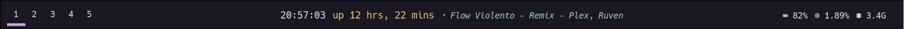

# dotfiles
dotfiles for my arch rice

## fastfetch
 

based on rose pine theme

2 configs are provided- `config.jsonc` and `config-smol.jsonc`. the regular config has more info and uses the large logo, while the small config is better if terminal space is limited and you just need core info

desktop users might want to swap out the `battery` key with `gpu` or something else
## waybar
 

also based on rose pine

remember to also copy over `rose-pine.css` which contains colors (for organization). also, install Hack Mono Nerd Font:

```bash
paru -S ttf-hack-nerd
fc-cache -fv
```
